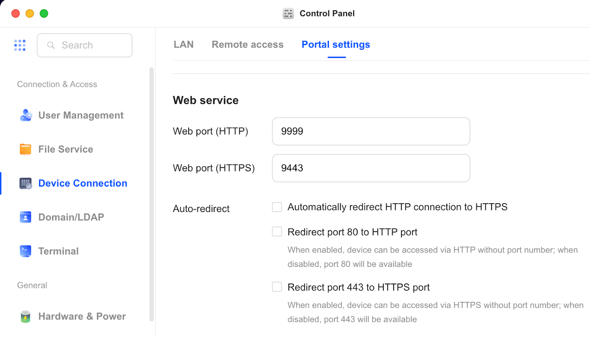
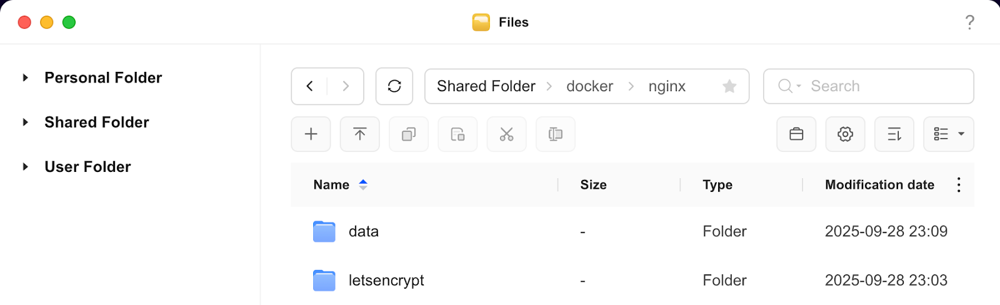
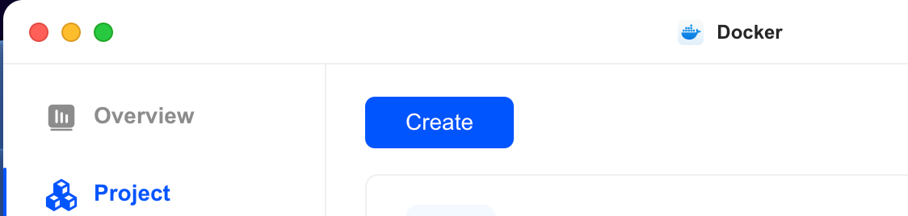
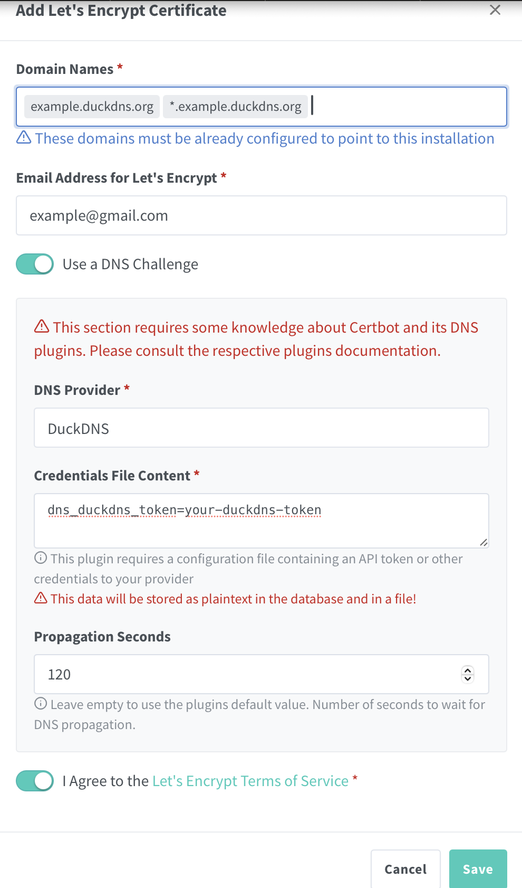
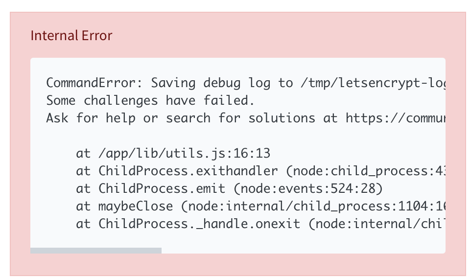

# Nginx Setup for UGREEN NAS
[Official Nginx Proxy Manager Documentation](https://nginxproxymanager.com/setup/)

## Nginx Installation on UGREEN NAS
1. Disable auto-redirect to port 80 and 443 in **Control Panel** under **Device Connection** and **Portal Settings**
    - 
2. Go to App Center on UGOS and install Docker. Alternatively, you can install Portainer or other container management software.
3. Create folders on NAS
    1. Go to Files app and navigate to docker folder
    2. Create a folder and name it **nginx**
    3. Create two subfolders within **nginx** and name them: **data** and **letsencrypt**
    - 
4. Docker installation
    1. Open Docker app
    2. On the left hand side, click **Project** and click **Create** button
        -  
    3. In the **name** field enter: **nginx**
    4. In the **compose configuration** field, paste the following [yaml file](https://github.com/EszopiCoder/ugreen-docker-guides/blob/main/apps/nginx/nginx-docker-compose.yaml)
    5. Click **Deploy** button
5. Portainer installation
    1. Login to Portainer
    2. On the left hand side, click **Home** then **Live connect**
    3. On the left hand side, click **Stacks**
    4. Click **+ Add stack** button
    5. In the **name** field enter: **nginx**
    6. In the **compose configuration** field, paste the following [yaml file](https://github.com/EszopiCoder/ugreen-docker-guides/blob/main/apps/nginx/nginx-docker-compose.yaml)
    7. Click **Deploy the stack** button
6. Go to [NAS IP]:81/login and login using [default login information](https://nginxproxymanager.com/setup/#default-administrator-user). Set username/email and password.
  
## Buy or Obtain a Domain Name
I recommend using [Cloudflare](https://www.cloudflare.com) because they only charge for the domain name and don't add any additional fees.

If you would like a free domain, one option you can use is [DuckDNS](https://www.duckdns.org).

## Add SSL Certificate
1. Go to [NAS IP]:81/login and login
    - To find NAS IP, go to **Control Panel** -> **Network** -> **Network connection**. If IP is not static, click **Edit** and change to **static**.
2. Click **SSL Certificate** tab and click **Add SSL Certificate** and **Let's Encrypt**
3. In **Domain Names** textbox, add [DuckDNS](https://www.duckdns.org) domain and `*.` plus domain name. Adding domain name with `*.` wildcard allows any subdomain to use the same SSL certificate. Enable **Use a DNS Challenge** and enter a **token** from [DuckDNS](https://www.duckdns.org). Agree to terms of service and click the **Save** button. If there is an error (shown below), change **Propagation Seconds** to **120** and continue trying until a SSL certificate is generated. Anecdotally, I have had to try several times before I received a SSL certificate.
    - 
    - 

## Add Proxy Host
1. Go to [NAS IP]:81/login and login
    - To find NAS IP, go to **Control Panel** -> **Network** -> **Network connection**. If IP is not static, click **Edit** and change to **static**.
2. On dashboard, click **Proxy Hosts** tile and click **Add Proxy Host** button
3. Fill out the following information. For the **Foward Hostname / IP**, use the NAS IP address and select appropriate port (port 81 for Nginx). In this case, we are creating a proxy for Nginx at npm.example.duckdns.org
4. Click the **SSL** tab to setup SSL certificate for this domain. Select **Force SSL** and **HTTP/2 Support**. If you want this to be at a HTTPS address, select all options (required for applications like WireGuard).
5. Click **Save** button. You should now be able to reach Nginx at npm.example.duckdns.org
