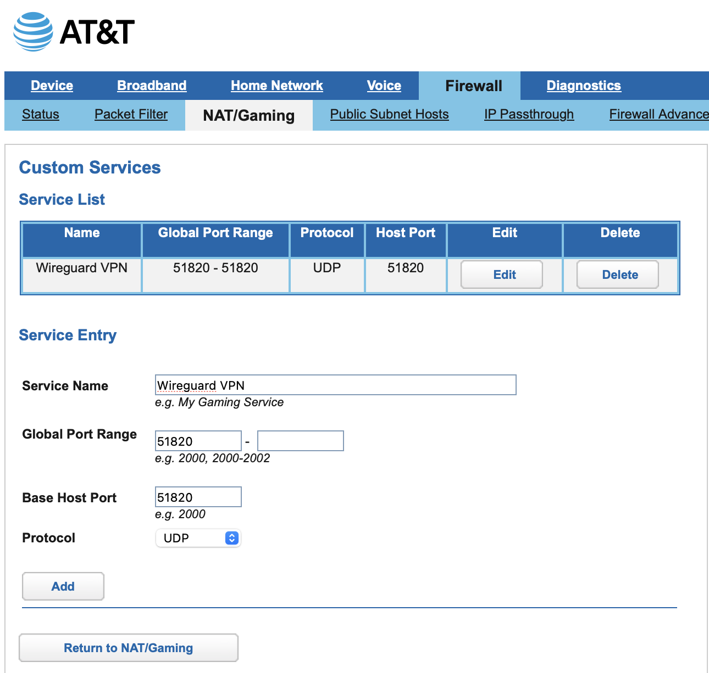
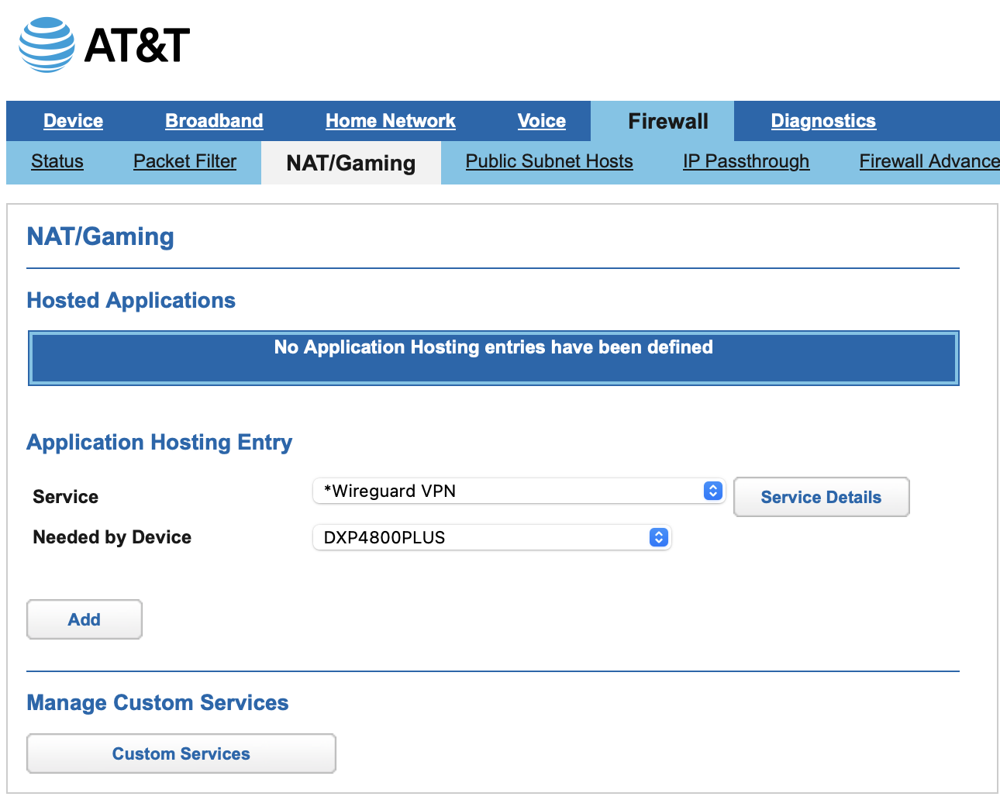

# WireGuard Setup for UGREEN NAS
[Official WireGuard documentation](https://wg-easy.github.io/wg-easy/latest/)

## Requirements
- Reverse proxy manager (Caddy, Nginx, Traefik)
    - You can do initial set up without reverse proxy by uncommenting code [(see notes in yaml file)](https://github.com/EszopiCoder/ugreen-docker-guides/blob/main/apps/wireguard/wg-easy-docker-compose.yaml)
    - **WARNING: Setting up without a reverse proxy poses security risks!**
- Container manager (e.g., Docker or Portainer)

## WireGuard Installation on UGREEN NAS
1. Go to App Center on UGOS and install Docker. Alternatively, you can install Portainer or other container management software.
2. Create folders on NAS
    1. Go to Files app and navigate to docker folder
    2. Create a folder and name it **wg-easy**
    3. Create a subfolder within **wg-easy** and name it: **wireguard**
3. Docker installation
    1. Open Docker app
    2. On the left hand side, click **Project** and click **Create** button
        -  
    3. In the **name** field enter: **wg-easy**
    4. In the **compose configuration** field, paste the following [yaml file](https://github.com/EszopiCoder/ugreen-docker-guides/blob/main/apps/wireguard/wg-easy-docker-compose.yaml)
    6. Click **Deploy** button
4. Portainer installation
    1. Login to Portainer
    2. On the left hand side, click **Home** then **Live connect**
    3. On the left hand side, click **Stacks**
    4. Click **+ Add stack** button
    5. In the **name** field enter: **wg-easy**
    6. In the **compose configuration** field, paste the following [yaml file](https://github.com/EszopiCoder/ugreen-docker-guides/blob/main/apps/wireguard/wg-easy-docker-compose.yaml)
    7. Click **Deploy the stack** button  
  
## Router Setup
Change router settings (Disclaimer: Every router has slightly different settings. These instructions are specific to my AT&T router: AT&T BGW320-500)
1. Login to router
2. Click **Firewall** tab, **NAT/Gaming** tab, then **Custom Services** button. Add the following information to add WireGuard as a custom service. **Global Port Range** and **Base Host Port** should both be **51820**. Protocol should be **UDP**. **Name** can be anything you want.
   - 
3. Click **Return to NAT/Gaming** button. Select custom service you just created. **Needed by Device** field should be the **name of your NAS**.
   - 
4. Click **Add** button. Router setup is complete!
  
## WireGuard Server Setup
1. Optional (RECOMMENDED): Set up a reverse proxy. I used Nginx and with a [free DuckDNS domain](https://www.duckdns.org) to test this out. Please see [Nginx set up guide](https://github.com/EszopiCoder/ugreen-docker-guides/blob/main/apps/nginx/Nginx%20Setup.md) for tutorial on how to install and use Nginx.
   - **WARNING: Setting up without a reverse proxy poses security risks!**
2. Go to WireGuard web UI at [NAS IP]:51821 or domain name
   - To find NAS IP, go to **Control Panel** -> **Network** -> **Network connection**. If IP is not static, click **Edit** and change to **static**.
    - Note: If you did not set up a reverse proxy and did not uncomment the environment code in the yaml file, you will not be able to login
3. Follow set up instructions. For host name, click the **Suggest** button and choose **[Public Router IP] - IPv4 - Public**. To find your public router IP, go to [https://whatismyipaddress.com](https://whatismyipaddress.com).

## WireGuard Client Setup (Mobile)
1. Download WireGuard app on mobile device from app store
2. On computer, go to WireGuard web UI at [NAS IP]:51821 or domain name and login
    - To find NAS IP, go to **Control Panel** -> **Network** -> **Network connection**. If IP is not static, click **Edit** and change to **static**.
    - Click **New** button and **name** connection
    - Click on **QR code button** to generate QR code
3. On mobile phone, click **+** icon in the upper right hand corner. Click **Create from QR code**. Allow phone to scan QR code to complete setup.
4. After creating the connection, you can click on the connection and **Edit** to change **On-demand activation**. If you turn **Cellular** on, the VPN will automatically connect if your phone switches to cellular data.
5. Client set up is complete!

## WireGuard Client Setup (Desktop)
1. Download [WireGuard app](https://www.wireguard.com/install/) on desktop
2. On computer, go to WireGuard web UI at [NAS IP]:51821 or domain name and login
    - To find NAS IP, go to **Control Panel** -> **Network** -> **Network connection**. If IP is not static, click **Edit** and change to **static**.
    - Click **New** button and **name** connection
    - Click on **Download button** to download configuration file
3. Click **Import tunnel(s) from file** button. Find file and click **Import** button
4. Client set up is complete!
